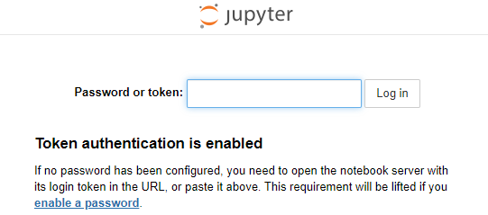
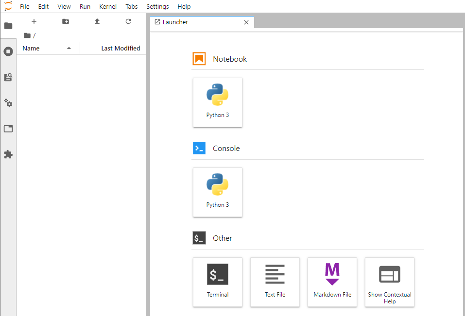
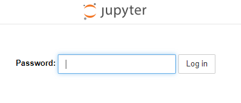

データ分析ではJupyterLabやJupyterNotebookを使うことも多いかと思います。

ちょっとした処理ならローカルで動作させてもいいですが、重い計算を回すときはローカルではなくクラウド上の計算機を使いたい場合も多いと思います。

今回はAWS EC2上でJupyterLabを動かす方法についてメモしていきます。


# EC2インスタンスを起動してssh接続する

AWSコンソールにログインしてインスタンスを起動します。OSはpythonが入っているubuntuが良いかと思います。


自分のIPからの接続しか許可しないようにセキュリティグループを設定します


インスタンス概要の「パブリックIPv4アドレス」に書かれているIPに対してssh接続してサーバーにログインします。


# JupyterLabをインストールする

OSをubuntuにしている場合、pythonはすでに入っています。

```sh
$ python3 --version
Python 3.8.2
```


pipとライブラリ類を入れていきます。

```sh
sudo apt update
sudo apt install -y python3-pip
```


[公式ドキュメント](https://jupyter.org/install)を参考に、現バージョンで推奨されるインストール方法に従ってインストールしていきます。

```sh
pip3 install jupyterlab
```


PATHにないところにインストールされたようなWARNINGが出ていたので、PATHに追加しておきます。

```
WARNING: The scripts jupyter, jupyter-migrate and jupyter-troubleshoot are installed in '/home/ubuntu/.local/bin' which is not on PATH.
```

```sh
export PATH="$HOME/.local/bin:$PATH"
```


# JupyterLabを起動する

起動時には、jupyter-server側ではすべてのipを許可するように指定して起動します。

```sh
jupyter-lab --ip='0.0.0.0'
```

ローカルPCからブラウザで`http://<EC2インスタンスのパブリックIPv4>:8888`のアドレスに接続するとtokenの入力画面が出てきて、入力すればログインできます。

あるいは`http://<EC2インスタンスのパブリックIPv4>:8888/?token=<token>`のようにリクエストパラメータにtokenを含めると直接ログインできます。





ログインするといつものJupyterLabの画面になり、分析を開始できます。





# Jupyter Notebookを起動する

昔ながらのjupyter notebookも同様にipを指定して起動して使うことができます。

```sh
jupyter notebook --ip='0.0.0.0'
```


# TIPS：パスワードでログインしたい場合

tokenの入力が面倒な場合はパスワードを設定できます。

[Running a notebook server — Jupyter Notebook 6.1.4 documentation](https://jupyter-notebook.readthedocs.io/en/stable/public_server.html)

を参考に

```sh
$ jupyter notebook password
Enter password:  ****
Verify password: ****
```

の1コマンドで設定できます。




