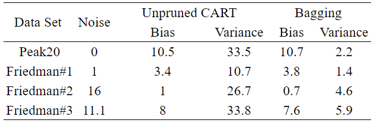

機械学習の分野では、バギング（bagging）というアンサンブル学習の方法があります。

**なぜバギングで予測精度が上がるのか？**という点について少し学んだのでメモしておきます。

# 予備知識

## バギングとは

バギング（bagging, “**b**ootstrap **agg**regat**ing**”の略）とは、多様性をもった複数の決定木を作り、その平均（回帰の場合）や多数決を行った結果（分類の場合）を最終的な予測値とする学習法です。

アルゴリズムは以下のようになります：

1. 元のデータを$\mathcal D=(\boldsymbol{x}, y)$とする。$\mathcal D$からサンプルサイズ$N$のデータを復元抽出する作業を$B$回繰り返し、新しいデータセット（ブートストラップ標本 bootstrap sample）を$B$個作る。
2. 各ブートストラップ標本$\{\mathcal D_b\}(b=1,2,...,B)$について、それぞれ予測器$\{f^b(\boldsymbol{x})\}_{b=1}^B$を学習させる。
3. ある入力点$\boldsymbol{x}_0$における予測値を算出するときは、$B$個の予測値$\{f^b(\boldsymbol{x_0})\}_{b=1}^B$の平均（回帰問題の場合）あるいは多数決（分類問題の場合）を行い、それを最終的な予測値とする。

## バイアスとバリアンス

誤差はバイアスとバリアンスという構成要因に分解できます。

データがモデル$Y=f(X) + \varepsilon$から生成されたとし、$\text{E}(\varepsilon)=0,\ \text{Var}(\varepsilon)=\sigma^2_{\varepsilon}$とします。議論を簡潔にするため、データにおける$x_i$の値は決定論的に決められているとします。そのとき、$X=x_0$における期待予測誤差、もしくは汎化誤差と呼ばれるものは
$$
\begin{align}\text{EPE}(x_0)&=\text{E}_{\mathcal D}[(Y-\hat{f}(x_0))^2|X=x_0]\\&= \sigma^2_{\varepsilon} + (\text{E}_{\mathcal D}[\hat{f}(x_0)] - f(x_0))^2+ \text{E}_{\mathcal D}[(\hat{f}(x_0) - \text{E}_{\mathcal D}[\hat{f}(x_0)])^2]\\&= \sigma^2_{\varepsilon} + \text{Bias}(\hat{f}(x_0))^2 + \text{Var}_{\mathcal D}(\hat{f}(x_0))\\&= \text{削減不能な誤差} + \text{バイアス}^2 + \text{バリアンス（分散）} \end{align}
$$
と分解できます。ただし、$\text{E}_{\mathcal D}$はいろいろな訓練サンプル集合$\mathcal D$についてとった平均です。各用語の意味は以下の通り：

- **削減不能な誤差**（irreducible error）：$\text{Var}_{\mathcal D}[Y|X=x_0]=\text{Var}_{\mathcal D}[\varepsilon]=\sigma^2_{\varepsilon}$
  データの測定誤差などに由来する、目的変数の分散でありノイズの分散
- **バイアス**（Bias）：$\text{E}_{\mathcal D}[\hat{f}(x_0)] - f(x_0)$
  平均的な予測値と真の値との差
- **バリアンス**（Variance）：$\text{E}_{\mathcal D}[\hat{f}(x_0) - \text{E}_{\mathcal D}[\hat{f}(x_0)]]^2$
  予測値の分散

# バギングによるバリアンスの低減

解析のため、真の分布$\mathcal P$から無限に学習データセットが得られるとし、その下で構成される理想的な平均化推定量（aggregated estimator）$\bar{f}(x) = \text{E}_{\mathcal P} [\hat{f}(x)]$があったとします。

ここで$\hat{f}(x)$は分布$\mathcal{P}$から独立に取り出した学習データ$\{x_i, y_i\}_{i=1}^N$で学習した予測器の、入力点$x$における予測値です。

固定された入力点$x$の下での平均2乗誤差（MSE）を分解すると
$$
\begin{align}\text{E}_{\mathcal P} [(Y - \hat{f}(x))^2]&= \text{E}_{\mathcal P} [(Y - \bar{f}(x) + \bar{f}(x) -\hat{f}(x))^2]\\
&=  \text{E}_{\mathcal P} [(Y - \bar{f}(x))^2]
+ \underbrace{\text{E}_{\mathcal P} [(\hat{f}(x) - \bar{f}(x))^2]}_{Variance}\\
&\geq \text{E}_{\mathcal P} [(Y - \bar{f}(x))^2]\end{align}
$$
2行目の第2項$\text{E}_{\mathcal P} [(\hat{f}(x) - \bar{f}(x))^2]$は平均$\bar{f}(x)$のまわりでの$\hat{f}(x)$の分散（バリアンス）です。

上の式は、$Y$と平均化推定量$\bar{f}(x)$の平均2乗誤差$\text{E}_{\mathcal P} [(Y - \bar{f}(x))^2]$は、$Y$と推定量$\hat{f}(x)$の平均2乗誤差$\text{E}_{\mathcal P} [(Y - \hat{f}(x))^2]$よりもバリアンスの分だけ小さいことを示しています。

一般的に、バイアスとバリアンスの間にはトレードオフ関係があり、バリアンスを下げるとバイアスが増える傾向がありますが、**バギングを使うことで、バイアスを増やさずにバリアンスをゼロにすることができる**わけです。

上の議論は真の分布$\mathcal P$から無限にデータセットが得られる場合で、現実にはありえません。Breiman (1996)が提案したバギングでは、この無限のデータセットをブートストラップサンプルで近似したものになります。ブートストラップによる現実のバギングでも、多くの場合はこのようにバリアンスを下げてくれます。

ただし、回帰においてバギングは平均2乗誤差を増加させず減少させますが、分類の場合は多数決になるので、一定以上の精度がないと逆に悪化させる可能性があります。

# バギングの効果

Breiman（1999）が行った実験結果をまとめたのが以下の表です。

Data Setはデータセット名、Noiseはデータセットのノイズ、Unpruned CARTは、枝刈りを行わなかった単体の決定木で、Baggingは枝刈りしていない50本の決定木で構成されたBaggingです。

理論解析の結論とほぼ合致していて、**Baggingが単体の決定木と同程度のBiasを保ったままVarianceを大幅に削減している**ことがわかります。

理論解析と違ってVarianceがゼロにならないのは、

1. データセットがブートストラップサンプルによる近似であること
2. 決定木同士の相関がある

という理由が考えられます。

# バギングと相関

分散$\sigma^2$の$B$個の独立な確率変数$X$の平均$\bar{X}$の分散は
$$
\text{Var}[\bar{X}] = \frac{\sigma^2}{B}
$$
になりますが、確率変数間に正の相関$\rho$がある場合は
$$
\text{Var}[\bar{X}] = \frac{1-\rho}{B} \sigma^2 + \rho \sigma^2
$$
となります。

ブートストラップ標本の数$B$を増やすと第1項は減りますが、第2項は残ります。

単純なバギングで決定木を作っただけでは$\rho \sigma^2$が残ってしまい、分散の低減効果が少なくなります。

そこでランダムフォレスト（Breiman  2001）では、複数の決定木を作っていくフェーズで、あらかじめ決めた数の特徴量をランダムに選び出して決定木を作ることで決定木間の相関を大幅に減らすように工夫されています。

# 参考

[Breiman, L. (1996). Bagging predictors. *Machine learning*, *24*(2), 123-140.](https://link.springer.com/content/pdf/10.1023/A:1018054314350.pdf)

[Breiman, L. (1999). Using adaptive bagging to debias regressions (p. 16). Technical Report 547, Statistics Dept. UCB.](https://www.stat.berkeley.edu/users/breiman/adaptbag99.pdf)

[Breiman, L. (2001). Random forests. *Machine learning*, *45*(1), 5-32.](https://link.springer.com/content/pdf/10.1023/A:1010933404324.pdf)