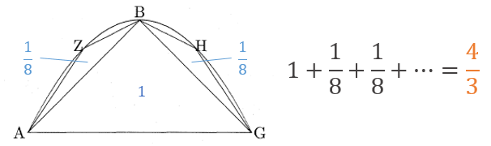
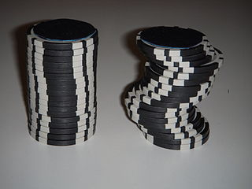
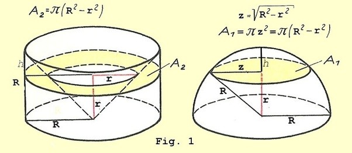

# 微分積分の歴史

## 古代

### アルキメデスの求積法

**取り尽くし法**

アルキメデス『放物線の求積』では，曲線の内側に多数の三角形を作り，足していった。

これはユークリッド『原論』にもある「取り尽くし法」

- [斎藤憲 (2010) アルキメデスの失われた写本を読む](http://www.sci.shizuoka.ac.jp/sciencecafe/news/20101203.pdf)

### 古代ギリシャ人の考え方

古代ギリシャ人達は一般的に無限を回避して議論していた。（無限はパラドクスを生み出したり，議論に厳密性を欠く可能性があるため）

## 中世

- 数学的発展はなし
- 12世紀ルネッサンスで古代ギリシャ・古代ローマの学問をアラビア世界から輸入

## 16～17世紀前半

### ケプラー（Kepler, 1571-1630）

- ドイツの天文学者
- 天体の運動に関する**ケプラーの法則**を発見
  （地動説の精緻化＋太陽と惑星の間に磁力のような引き合う働きを発見，などの功績）
- 「ケプラーの第2法則」（惑星と太陽とを結ぶ線分が単位時間に描く面積（面積速度）は一定である）で**扇形の面積を，アルキメデスのように無限に小さな三角形に分けて足し合わせることで計算**
- 『葡萄酒樽の新立体幾何学』（1615）
  - 樽に入ったワインの体積を，「無限に薄い円盤の集まりと見なす」ことで計算

### カヴァリエリ（Cavalieri, 1598-1647）

- ガリレオの弟子

- ケプラー『葡萄酒樽の新立体幾何学』にヒントを得て，「面を無限に小さく分割すると線になり，立体を無限に小さく分割すると面になる」と発想（**カヴァリエリの原理**）

  

- カヴァリエリの原理を使った議論

  - 「高さ・半径$R$のすり鉢形と半径$R$の半球の体積は，等しい」
    これを示すには，すべての切り口の面積が等しいことを証明すればよいことになる。

  - すり鉢形の断面積（ドーナツ型の部分）$A_2$は「半径$R$の円から，高さ$r$の円錐の断面積を引く」ことであり，図にあるように円錐の高さが$r$なら断面積の半径は$r$なので，
    $$
    A_2 = \pi R^2 - \pi r^2 = \pi(R^2-r^2)
    $$

  - 半球の断面積$A_1$は$\pi z^2$で，三平方の定理から$R^2=z^2+r^2$であり，$z^2=R^2-r^2$なので
    $$
    A_1 = \pi z^2 = \pi(R^2-r^2)
    $$

  - したがって，２つの立体の体積は等しい。

    

  

### トリチェッリ（Torricelli, 1608-1647）

- ガリレオの弟子
- 最も有名な業績は実験により「真空」を発見したこと
  - アリストテレスは自然界に真空はないと考えていて（「自然は真空を嫌う」），17世紀もその考えが根強く信じられていた。
    （とはいえ，ポンプで汲み上げられる高さに限界があることなど，真空を認めなければ説明できない事象が多くなっていた）
- カヴァリエリの考え方を発展させ，放物線に囲まれた部分の面積や，曲線を回転させてできる立体の体積を求める方法を考案

### 17世紀前半までの積分まとめ

- アルキメデスの時代から，円や放物線などの**「特定の曲線に関する求積法」は見つかってきたが，「どんな曲線にも対応できる一般的な求積法」はまだ見つかっていなかった**

## 17世紀後半：微分積分の基本定理の発見

### この頃の社会的背景

- 「砲弾の弾道計算をしたい」というニーズがあった

- 重力に従って次第に落ちていき，刻々と進行方向を変化させる弾道を捉える方法がなかった

  → **変化を計算する新しい数学（のちの微分法）が求められた**

### ロベルヴァル（Roberval, 1602-1675）

- 「運動する物体の軌跡（曲線）の**接線が，その瞬間のその物体の進行方向を示す**」ことを明らかにした
  - → 正確に接線を引くには，接線をどう引いたらいいのか？という問題が生じた

### 接線問題

- デカルトやフェルマーなど多くの数学者が「接線をどう引くか」という問題に取り組んだ
- 特定の曲線に対する接線の引き方は考案されたが，どの曲線にも使える一般的な方法が見つからなかった
- フェルマーは一般的な計算方法に最も迫っており，ニュートンもフェルマーを参考にした

### ニュートン（Newton, 1643-1727）

- 主な功績

  1. 万有引力の法則の発見とニュートン力学の創始（1687『プリンキピア』）
  2. 微分積分の基本定理（「微分と積分が互いに逆の操作・演算である」）を発見

- 1665年5月ごろまでには微積分の基本定理を認識していたとされているが，本としては出版したのは『求積論』（1704）

  - そのため後にライプニッツと先取権争いが起こった

- 微積分の発想：運動の変化量を捉える

  - 「紙の上に書かれた曲線は，時間とともに動く小さな点が動いた軌跡である」という考え方

  - 動く点の進行方向を計算することで，接線の傾きを求める

    - ニュートンは点の動く速度を「流率」と呼び，動く線が作る面積を「流量」と呼んだ

  - 一瞬の時間を表す「$\omicron$（オミクロン）」という記号を使用

  - 動く点が$x$軸方向に移動した距離を$\omicron p$，$y$軸方向に移動した距離を$\omicron q$とし，一瞬の間に点が動いた軌跡の直線の傾きを$\frac{\omicron q}{\omicron p}=\frac{q}{p}$で表した。

    - 例えば$y=x^2$という関数で（$3, 9$）という地点の傾きは，

    $$
    \begin{align}
    y&=x^2 \\
    (9+\omicron q)&=(3+\omicron p)^2 \\
    9+\omicron q&=9+6 \omicron p + \omicron^2 p^2\\
    \omicron q&=6 \omicron p + \omicron^2 p^2 \\
    \frac{\omicron q}{\omicron p}&=6  + \omicron p \\
    & o \text{は限りなく小さいため，右辺の}op \text{は無視できて}\\
    \frac{q}{p}&=6 
    \end{align}
    $$

    - 上記の例で導関数を求めるには，3を$a$とおき，

    $$
    \begin{align}
    y&=x^2 \\
    (a^2+\omicron q)&=(a+\omicron p)^2 \\
    a^2+\omicron q&=a^2+2a \omicron p + \omicron^2 p^2\\
    \omicron q&=2a \omicron p + \omicron^2 p^2 \\
    \frac{\omicron q}{\omicron p}&=2a+ \omicron p \\
    & o \text{は限りなく小さいため，右辺の}op \text{は無視できて}\\
    \frac{q}{p}&=2a
    \end{align}
    $$

- 表記法

  - ニュートンは後に記号を変更している
    - 接線の傾きを表す記号は$\frac{q}{p}$から$\frac{\dot{y}}{\dot{x}}$に，$\omicron p$は$\omicron \dot{x}$に，$\omicron q$は$\omicron \dot{y}$にした。
  - 積分の記号は$\acute{x}$
  - やはりライプニッツの記法のほうが使いやすかったのであまり流行らなかった。今は物理学で使われることがあるらしい。

  

### ライプニッツ（Leibniz, 1646-1716）

- 多方面で才能を発揮した人
  - 手回し計算機の発明，二進法の考案，哲学での単子論の提唱，物理学での現代のエネルギーに近い概念の考案…
- 1675年に微積分の基本定理を発見
- 1684年に微分の論文「極大と極小にかんする新しい方法」を発表
- 1686年に積分の論文「深遠な幾何学」を発表
- 微積分の発想：幾何学的な特徴を突き詰めていく
- 表記法
  - 接線の傾きは$\frac{dy}{dx}$
  - 積分は$\int y dx$
  - 先取権争いは負けたが，記法はライプニッツが勝った

## 18世紀：「無限」を使う微積分の厳密性が問われる

### その後はライプニッツの後継者が微積分を洗練させた

- ベルヌーイ兄弟，ロピタル，ラグランジュ，フーリエ達が洗練させて後世に伝えて普及させた

- 現在の「積分（calculus）」という呼び方もライプニッツの呼び方が元

  - ニュートンは「流率（fluxionum）」と呼んだ

  

### バークリ（Berkeley, 1685-1753）

- 哲学者。

- 1734『解析家―不信心な数学者へ向けての論説』

  - 微積分は「無限に小さい」という，0に等しいような，等しくないような存在を使っての議論であるため，**微積分の基礎に関して厳密性が欠けていることを批判**

  - ”はじめは「$\omicron \neq 0$」として議論をはじめ，最後には「$\omicron = 0$」とするのはおかしい”

    

### マクローリン（Maclaurin, 1698-1746）

- ニュートンの弟子
- 1742『流率論考』
  - 「無限小」はニュートンが微積分法の証明を簡略化するために使った考え方
  - **無限小を使わずとも，アルキメデスの厳密な論証法と運動学的な直観に基づく方法によって微積分学の基礎づけは可能である**と主張
  - この考えはイギリスの多くの数学者に受け入れられたものの，論争の完全解決にはならず

### オイラー（Euler, 1707-1783）

- 1744『極大または極小の性質を持つ曲線を見出す方法，あるいは最広義での等周問題の解法』

  - 微分方程式に関連する「**変分法**」という学問の確立を目指して書かれた

- 1748『無限解析入門』

  - 解析の教科書
  - 1696年にロピタル・ベルヌーイが書いた無限解析の教科書とは異なり，オイラーは関数（functio）の定義から始めている（関数を重要視）
  - 関数（functio）という用語は，「曲線に対する接線と関連する量」といった意味でライプニッツによって使用されていたが，「解析的表示」として**関数の概念を明確に規定したのはオイラーが最初**

  

### ラグランジュ（Lagrange, 1736-1813）

- オイラーの後継者

- 関数の概念を考察

- 1797『解析関数論』

  - 任意の関数$f(x)$がテイラー級数
    $$
    f(x+i)=f(x)+f'(x)i+\frac{f''(x)}{2!}i^2+\frac{f'''(x)}{3!}i^3+\cdots
    $$
    に展開できることを純粋に代数的な方法で立証

  - すべての関数$f(x)$は級数に展開できることを前提に
    $$
    f(x+i)=f(x)+pi+qi^2+ri^3+\cdots
    $$
    とおき，$i$に依存しない$x$の関数$p,q,r,\cdots$を計算してテイラー級数展開を導いた。

  - 一番目の関数$p$は$f(x)$から「導かれた」関数で，$f'(x)$と表した。→「**導関数**」

  - この証明の利点の一つは，無限小を巡る基礎の問題に関する不確実性から微積分が開放されたかもしれないということ。

  - それは微積分学が幾何ではなく代数として確立されることを保証するものだった

    - 関数と導関数だけに焦点をあわせればよい
    - ラグランジュの証明は不完全だったが，微積分学を新たな段階へ進めた

- ラグランジュの理論は批判されることになったが，その取り組みはコーシーに影響を与えた

### コーシー（Cauchy, 1789-1857）

- ラグランジュの考えに沿って，幾何学的な直観に依存しない厳密性を代数解析に持ち込むという「代数解析の厳密化」を推し進めた一人
- 1821『王立エコール・ポリテクニクの解析学教程―第一部 代数解析』（通称『解析教程』）
  - 「**極限**」をかなめとした基礎づけ
    - 無限小量を，極限が0となる変量と定義
    - そこから連続関数を定義
  - 極限概念を用いた級数の収束に多くのページを割いた（「**コーシーの収束判定法**」）
- 1823『王立エコール・ポリテクニクの無限小計算講義要録』
  - コーシーの極限概念として有名な「**ε―δ論法**」が登場
  - この論証法により，「限りなく」や「近づく」といったあいまいな用語の使用を回避して**導関数を厳密に定義することに成功**

